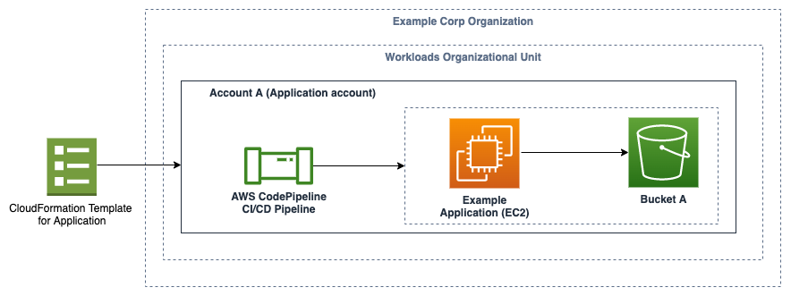

## Overview

The goal of this repository is to demonstrate a sample implementation for the "IAM Policy Types:  How and when to use them" blog post.  The blog post provides prescriptive guidance on what the different IAM policy types are and when you should use each policy. 

The policies from the blog post in JSON format can be found in the policies directory.

The templates in the cloudformation-templates directory deploy a CI/CD pipeline that has the ability to create IAM roles that are limited in permissions by a permissions boundary.  They also provide an example of an application deployment by a development team using an EC2 instance that communicates with an S3 bucket in the same account.  The architecture described can be seen in the image below.

### Deploying the example

Run the deploy-templates.sh script in the cloudformation-templates directory which will deploy two CloudFormation templates.  The first (pipeline.yml) will deploy the CI/CD pipeline that has the ability to create IAM roles with a permissions boundary attached.  The second (sample-application.yml) deploys an EC2 instance through the CI/CD pipeline with an IAM role that is bounded by the permissions boundary.

#### Important note: This deploys a (micro) EC2 instance in your account.  Ensure that you delete the CloudFormation stacks that are created when you are finished so that you do not continue to be charged for this running instance.

### Logging in to the EC2 instance

[Follow the AWS Systems Manager Session Manager instructions](https://docs.aws.amazon.com/systems-manager/latest/userguide/session-manager-working-with-sessions-start.html#start-ec2-console) to log in to the EC2 instance deployed by the sample-application.yml template.
